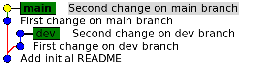

## Is a Local Merge Different from Merge on Github?

Some students report that merging on Github first merges *into* the feature branch and then back into main/master.

To see this, I created this repository with two divergent branches `main` and `dev`.  Then merged twice: once locally, once on Github.

Initial files:
- Add a README (like this one) to `main`.

## `dev` branch

- Create a `dev` branch.

- Switch to `dev` and modify README. Commit the changes.

- For visual clarity, I made more changes and committed again.

`main` branch is now behind `dev` by 2 commits.

## `main` branch

- Switch to `main` and add these lines to README. Commit the changes.

- For clarity (again), I made more changes to README and committed again.

## Graph of branches with divergent changes

## Push Everything to Github So We Can Repeat Merge Later

- Push both branches to Github before doing a local merge.
