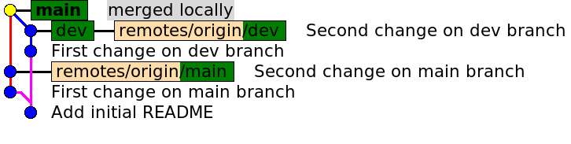
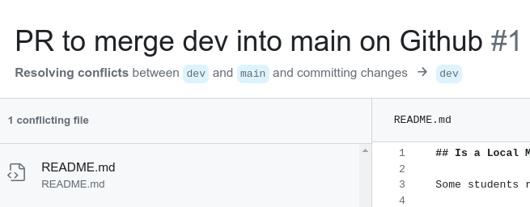
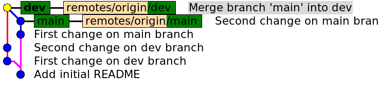
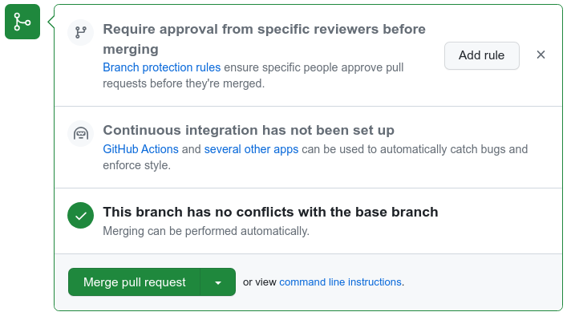
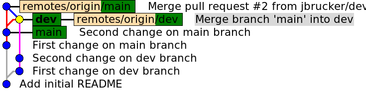

## Is a Local Merge Different from Merge on Github?

Students reported that merging on Github first merges *into* the feature branch and then back into main/master.

To see this, I created this repository with two divergent branches `main` and `dev`.  Then merged twice: once locally, once on Github.

Initial files:
- Add a README (like this one) to `main`.

## `dev` branch

- Create a `dev` branch.

- Switch to `dev` and modify README. Commit the changes.

- For visual clarity, I made more changes and committed again.

`main` branch is now behind `dev` by 2 commits.

## `main` branch

- Switch to `main` and add these lines to README. Commit the changes.

- For clarity (again), I made more changes to README and committed again.

## Graph of branches with divergent changes

After committing those changes, the repo looks like:


## Push Everything to Github So We Can Repeat Merge Later

- Push both branches to Github before doing a local merge.

## Local Merge

After pushing the pre-merged files on both branches to Github, I ran:

```
git checkout main
git merge dev

Conflict!

git mergetool     # I use a visual mergetool to fix conflicts
```
After resolving the conflict I committed the change to `main`
```
git add README.md
git commit -m "merged locally"
```
Now the repo looks like this. Notice that the merge commit is on **main**, not **dev**.



## Merge with PR on Github

On the pre-merged repository on Github, I created a Pull Request as suggested by Github.  Github reports conflicts and offers to open
a "conflict resolution editor" like this:



Notice at top: **Github is merging main into dev** not `dev` into `main`.

After resolving the conflict and commiting, the repo on Github looks like this:



Notice the new node on `dev` where the merge occurred.

## PR Merges `dev` into `main`

*After* resolving and commiting the conflict, Github presents the 
usual PR web page for a merge of `dev` -> `main`.



On a team project you would wait for the team to comment and approve.

I clicked "Merge pull request", and it merged `dev` into `main`. So finally the repository on Github looks like:



## Summary

When you merge branches with conflicts, Github's conflict resolver merges the changes into the branch.  

Its up to use to use a Pull Request to merge the branch into main or master. Or, you can close (abort) the PR to avoid changing the master branch.

This is safer than merging directly into master.

You can do this locally, too.  Simply checkout your feature branch and merge main/master into it *before* merging the feature branch into master.
